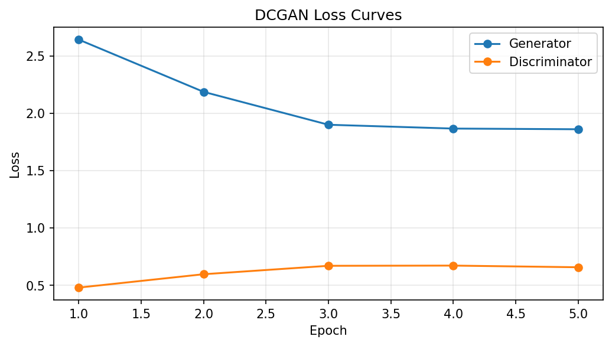
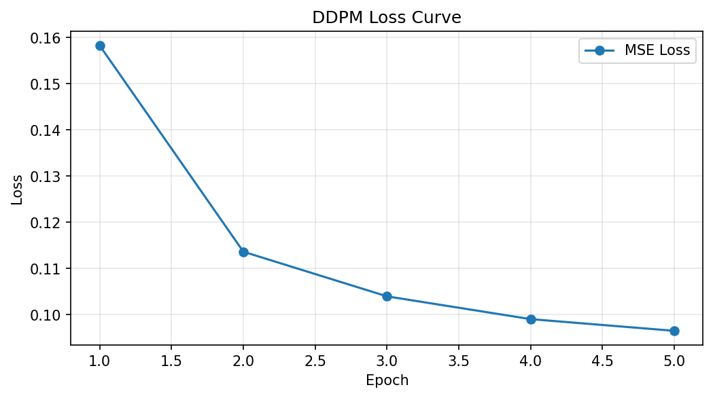
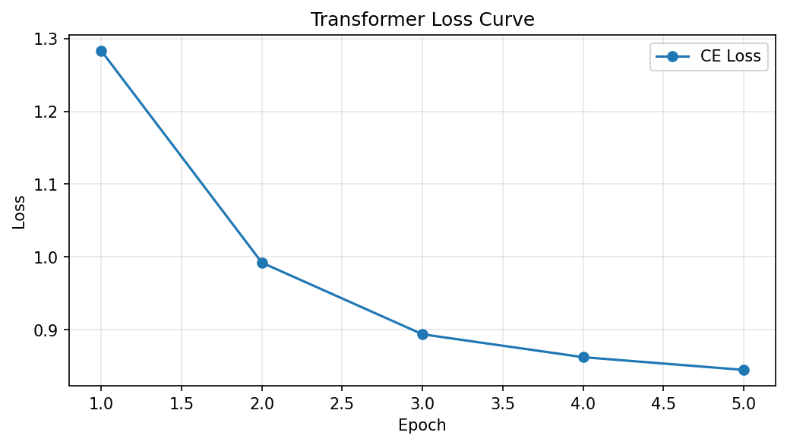
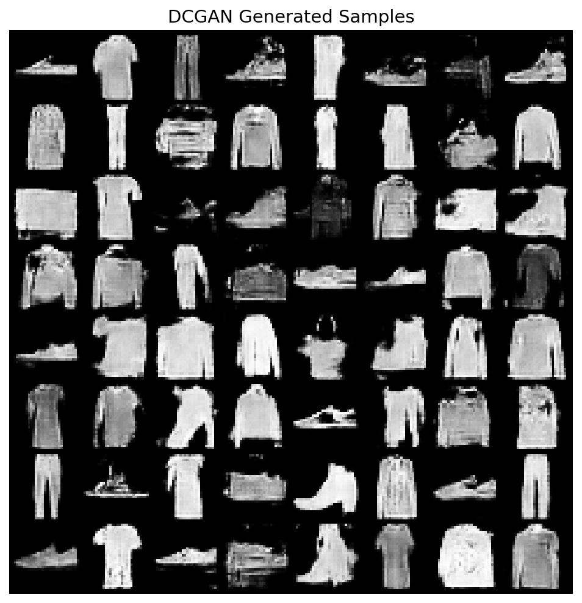
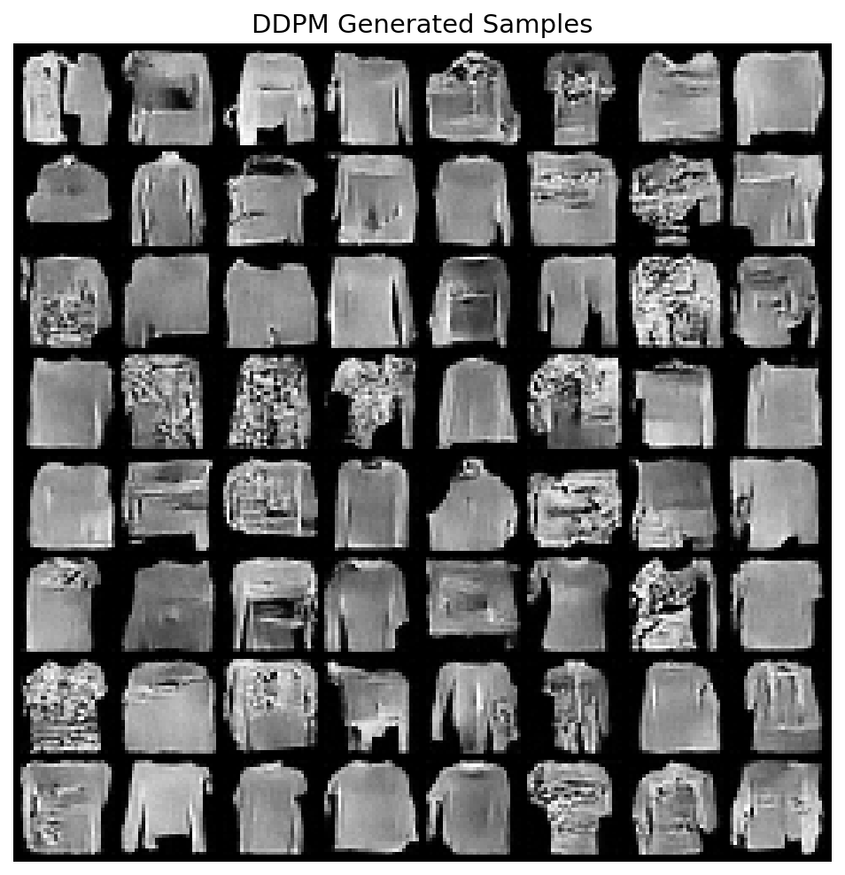
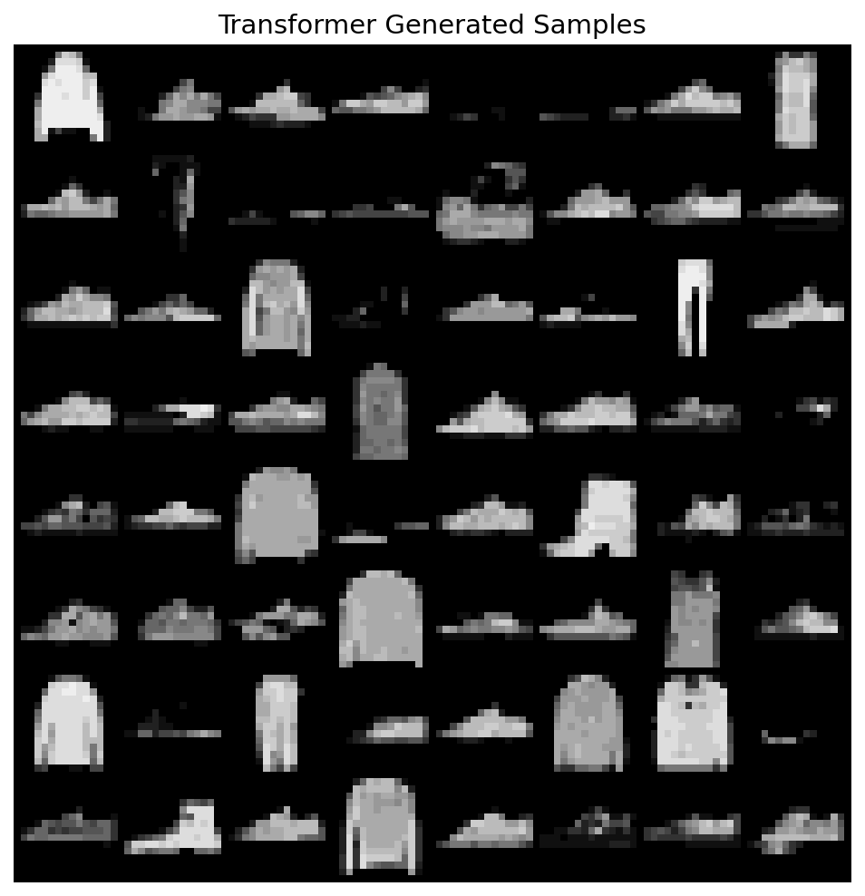
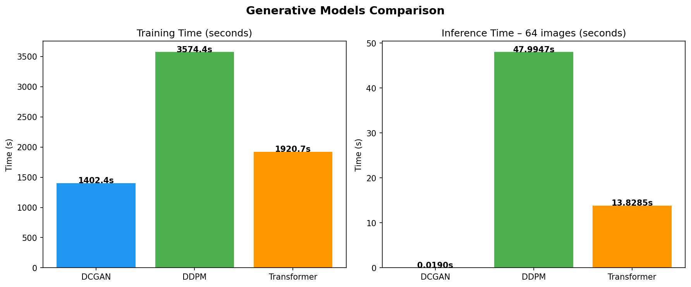

# Сравнительный анализ современных генеративных моделей

## Diffusion vs Transformers vs GANs

---

## Содержание

1. [Введение](#1-введение)
2. [Теоретический обзор](#2-теоретический-обзор)
   - 2.1 Генеративно-состязательные сети (GAN)
   - 2.2 Диффузионные модели
   - 2.3 Трансформеры для генерации изображений
3. [Сравнительный анализ](#3-сравнительный-анализ)
4. [Практический эксперимент](#4-практический-эксперимент)
5. [Результаты](#5-результаты)
6. [Выводы и перспективы](#6-выводы-и-перспективы)
7. [Список литературы](#7-список-литературы)

---

## 1. Введение

Генеративные модели — один из наиболее динамично развивающихся разделов глубокого обучения. Их задача — моделирование распределения данных $p(x)$ и генерация новых образцов, неотличимых от реальных. В данной работе рассматриваются три основных класса архитектур:

- **GAN** (Generative Adversarial Networks) — состязательное обучение генератора и дискриминатора.
- **Diffusion Models** — итеративное зашумление и обратное восстановление данных.
- **Transformers** — авторегрессионное моделирование последовательности токенов.

Цель работы — провести теоретический обзор (по 2 модели из каждого класса), практически реализовать по одной модели каждого класса на одном датасете и сравнить их по ключевым метрикам.

---

## 2. Теоретический обзор

### 2.1 Генеративно-состязательные сети (GAN)

GAN (Goodfellow et al., 2014) основаны на теоретико-игровой формулировке: генератор $G$ и дискриминатор $D$ играют в минимаксную игру:

$$\min_G \max_D \; \mathbb{E}_{x \sim p_{data}}[\log D(x)] + \mathbb{E}_{z \sim p_z}[\log(1 - D(G(z)))]$$

#### Модель 1: DCGAN (Radford et al., 2015)

**Deep Convolutional GAN** — одна из первых архитектур, стабилизировавших обучение GAN за счёт архитектурных принципов:
- Замена полносвязных слоёв на свёрточные/транспонированные свёрточные.
- Использование BatchNorm во всех слоях (кроме выхода G и входа D).
- Функция активации ReLU в генераторе, LeakyReLU в дискриминаторе.
- Отсутствие пулинга — уменьшение/увеличение разрешения через stride.

**Архитектура генератора:** вектор $z \in \mathbb{R}^{100}$ проходит через линейный слой, reshape в тензор 256×7×7, затем серия ConvTranspose2d слоёв удваивает пространственное разрешение до 28×28. Выход через Tanh → [-1, 1].

**Архитектура дискриминатора:** зеркальная — серия Conv2d слоёв с stride=2 уменьшает разрешение, финальный линейный слой даёт скаляр (логит real/fake).

#### Модель 2: StyleGAN2 (Karras et al., 2020)

**StyleGAN2** — state-of-the-art GAN для генерации изображений высокого разрешения:
- **Mapping Network** — MLP преобразует $z$ в промежуточное пространство $w$, что обеспечивает дизентангленное представление стилей.
- **Adaptive Instance Normalization (AdaIN)** — вектор $w$ инжектируется в каждый слой генератора через модуляцию/демодуляцию весов.
- **Progressive growing** заменён на skip-connections и residual блоки.
- **Path length regularization** — регуляризация, обеспечивающая плавность латентного пространства.

StyleGAN2 генерирует фотореалистичные лица 1024×1024 и остаётся стандартом в задачах безусловной генерации изображений.

---

### 2.2 Диффузионные модели

Диффузионные модели (Sohl-Dickstein et al., 2015; Ho et al., 2020) определяют процесс постепенного зашумления данных (forward process) и обучают нейросеть обращать этот процесс (reverse process).

#### Модель 1: DDPM (Ho et al., 2020)

**Denoising Diffusion Probabilistic Model** — основополагающая работа:
- **Forward process:** за $T$ шагов к данным $x_0$ добавляется гауссов шум по расписанию $\beta_1, \ldots, \beta_T$:
  $$q(x_t | x_{t-1}) = \mathcal{N}(x_t; \sqrt{1-\beta_t}\, x_{t-1}, \beta_t \mathbf{I})$$
- **Reverse process:** нейросеть $\epsilon_\theta(x_t, t)$ предсказывает добавленный шум. Обучение по simplified loss:
  $$L = \mathbb{E}_{t, x_0, \epsilon}\left[\|\epsilon - \epsilon_\theta(x_t, t)\|^2\right]$$
- **Архитектура:** U-Net с time-conditioning через sinusoidal embeddings, self-attention в bottleneck.
- **Сэмплирование:** итеративное — начиная с $x_T \sim \mathcal{N}(0, \mathbf{I})$, за $T$ шагов восстанавливается $x_0$.

#### Модель 2: Stable Diffusion / Latent Diffusion Model (Rombach et al., 2022)

**LDM** работает не в пиксельном пространстве, а в латентном:
- **Encoder** (VQ-VAE / KL-VAE) сжимает изображение $x$ в латент $z = E(x)$ (например, 512×512 → 64×64×4).
- **Diffusion** применяется к латенту $z$, что значительно снижает вычислительные затраты.
- **Decoder** восстанавливает изображение из денойзенного латента: $\hat{x} = D(\hat{z})$.
- **Conditioning:** cross-attention позволяет подавать текстовые эмбеддинги (CLIP) в U-Net, что обеспечивает text-to-image генерацию.

LDM (Stable Diffusion) — основа большинства современных text-to-image систем.

---

### 2.3 Трансформеры для генерации изображений

Трансформеры (Vaswani et al., 2017), изначально разработанные для NLP, успешно адаптированы для генерации изображений.

#### Модель 1: Image GPT (iGPT) (Chen et al., 2020)

**iGPT** применяет GPT-архитектуру к последовательностям пикселей:
- Изображение разворачивается в 1D-последовательность пикселей (raster order).
- Пиксели квантуются в $k$ кластеров (k-means на цветовом пространстве).
- Авторегрессионный трансформер обучается предсказывать следующий токен:
  $$p(x) = \prod_{i=1}^{n} p(x_i | x_1, \ldots, x_{i-1})$$
- Генерация — последовательная: по одному токену за шаг.
- Масштабирование до 1.4B параметров показало конкурентное качество на ImageNet.

#### Модель 2: DiT — Diffusion Transformer (Peebles & Xie, 2023)

**DiT** заменяет U-Net в диффузионных моделях на трансформер:
- Изображение разбивается на патчи (аналогично ViT), каждый патч = токен.
- Трансформер с adaptive layer norm (adaLN-Zero) кондиционируется на timestep и class label.
- Масштабирование модели (до DiT-XL/2) напрямую улучшает FID.
- DiT-XL/2 достиг state-of-the-art FID=2.27 на ImageNet 256×256.
- Показал, что трансформерные backbone масштабируются лучше, чем конволюционные U-Net.

---

## 3. Сравнительный анализ

### 3.1 Сводная таблица

| Критерий | GAN | Diffusion | Transformer |
|---|---|---|---|
| **Принцип обучения** | Adversarial (min-max game) | Denoising score matching | Autoregressive / masked prediction |
| **Loss-функция** | BCE / Wasserstein | MSE (noise prediction) | Cross-Entropy (next token) |
| **Скорость обучения** | ⚡ Быстрая | 🐢 Медленная (T шагов на batch) | ⚡ Средняя |
| **Скорость инференса** | ⚡⚡ Мгновенная (1 forward pass) | 🐢🐢 Очень медленная (T итераций) | 🐢 Медленная (N авторегрессивных шагов) |
| **Качество генерации** | Высокое, но mode collapse | Очень высокое, разнообразие | Высокое при масштабировании |
| **Стабильность обучения** | ❌ Нестабильное | ✅ Стабильное | ✅ Стабильное |
| **Гибкость (conditioning)** | Ограниченная (cGAN) | Высокая (cross-attention) | Естественная (prompt/context) |
| **Сложность реализации** | Средняя | Высокая | Средняя |
| **Масштабируемость** | Ограниченная | Высокая (LDM) | Очень высокая (scaling laws) |
| **Контролируемость** | Низкая | Средняя (guidance) | Высокая (через prompt) |

### 3.2 Детальное сравнение

**Скорость:**
- GAN — чемпион по инференсу: один forward pass генератора (~мс).
- Diffusion — самый медленный: требует T=200–1000 шагов денойзинга (ускоряется через DDIM, DPM-Solver).
- Transformer — зависит от длины последовательности: для 196 токенов ~14 секунд на CPU (64 изображения).

**Качество:**
- Diffusion модели лидируют по FID/IS на большинстве бенчмарков.
- GAN дают чёткие изображения, но склонны к mode collapse (ограниченное разнообразие).
- Transformers при достаточном масштабе (iGPT-XL, DiT-XL) конкурируют с diffusion.

**Гибкость:**
- Transformers — наиболее гибкие благодаря естественной интеграции с текстовым conditioning.
- Diffusion — гибкие через classifier-free guidance и cross-attention.
- GAN — требуют специальных архитектурных модификаций для conditioning.

---

## 4. Практический эксперимент

### 4.1 Условия эксперимента

| Параметр | Значение |
|---|---|
| **Датасет** | Fashion-MNIST (60,000 изображений, 28×28, grayscale) |
| **Устройство** | CPU (Apple Silicon) |
| **Batch size** | 128 |
| **Learning rate** | 2×10⁻⁴ |
| **Эпохи** | 5 (для каждой модели) |
| **Framework** | PyTorch 2.10 |

### 4.2 Реализованные модели

1. **DCGAN** — Generator (ConvTranspose2d: 7×7→14×14→28×28) + Discriminator (Conv2d: 28→14→7→4). Loss: BCEWithLogitsLoss.
2. **DDPM** — SimpleUNet (Encoder→Bottleneck→Decoder с skip connections). 200 timesteps, linear beta schedule. Loss: MSE (noise prediction).
3. **Image Transformer** — 4-layer GPT-style. Изображения downsampled до 14×14=196 токенов, квантованы в 16 уровней. Loss: CrossEntropy.

---

## 5. Результаты

### 5.1 Метрики производительности

| Модель | Время обучения | Инференс (64 img) | Отн. скорость обучения | Отн. скорость инференса |
|---|---|---|---|---|
| **DCGAN** | 1402.4s (~23 мин) | 0.019s | 1.0× (baseline) | 1.0× (baseline) |
| **DDPM** | 3574.4s (~60 мин) | 47.995s | 2.5× медленнее | 2526× медленнее |
| **Transformer** | 1920.7s (~32 мин) | 13.828s | 1.4× медленнее | 728× медленнее |

### 5.2 Кривые потерь

#### DCGAN Loss

- Generator loss стабилизируется около 1.86, Discriminator — около 0.66.
- Типичная динамика для GAN: генератор и дискриминатор балансируют друг друга.

#### DDPM Loss

- MSE loss монотонно снижается: 0.158 → 0.097 за 5 эпох.
- Стабильное обучение без осцилляций — характерная черта диффузионных моделей.

#### Transformer Loss

- Cross-entropy loss снижается: 1.28 → 0.84 за 5 эпох.
- Плавное снижение — стабильное авторегрессионное обучение.

### 5.3 Сгенерированные изображения

#### DCGAN Samples

DCGAN генерирует узнаваемые формы одежды (футболки, штаны, обувь). Изображения достаточно чёткие, но видно ограниченное разнообразие — признак начинающегося mode collapse.

#### DDPM Samples

DDPM генерирует более разнообразные и структурированные изображения. Формы объектов узнаваемы, хотя при 5 эпохах и 200 timesteps остаётся лёгкий шум.

#### Transformer Samples

Transformer генерирует изображения с характерной пиксельной структурой (из-за квантизации до 16 уровней и работы на разрешении 14×14). Формы узнаваемы, но качество ограничено дискретизацией.

### 5.4 Сравнительная визуализация

---

## 6. Выводы и перспективы

### 6.1 Основные выводы

1. **DCGAN** — лучший по скорости инференса (в 2500× быстрее DDPM), но обучение нестабильно и качество ограничено mode collapse.
2. **DDPM** — лучшее качество и разнообразие, но значительно медленнее и в обучении, и в инференсе.
3. **Transformer** — золотая середина по скорости обучения, но авторегрессивный инференс медленный. Качество ограничено дискретизацией.

### 6.2 Перспективы развития

#### GAN
- **Hybrid-подходы:** GigaGAN, StyleGAN-XL — масштабирование GAN до text-to-image.
- **Distillation:** использование GAN для ускорения диффузионных моделей (SDXL-Turbo).
- Проблема стабильности обучения остаётся главным ограничением.

#### Diffusion Models
- **Ускорение сэмплирования:** DDIM, DPM-Solver, Consistency Models (1-step generation).
- **Latent Diffusion:** работа в латентном пространстве (Stable Diffusion) резко сокращает вычисления.
- **Video и 3D:** расширение на Sora (OpenAI), SVD (Stability AI).
- Основное направление — уменьшение числа шагов при сохранении качества.

#### Transformers
- **Масштабирование:** DiT показал, что scaling laws работают для генерации изображений.
- **Multimodal:** естественная интеграция text+image (GPT-4o, Gemini).
- **Vector quantization:** VQ-VAE + Transformer (DALL-E 1, Parti) — токенизация через дискретные коды.
- Основной тренд — конвергенция с диффузионными моделями (DiT = Diffusion + Transformer).

### 6.3 Общий тренд

Современные state-of-the-art системы (DALL-E 3, Imagen, Stable Diffusion 3) комбинируют все три подхода: **Transformer backbone + Diffusion process + GAN-дистилляция для ускорения**. Границы между классами размываются, и будущее — за гибридными архитектурами.

---

## 7. Список литературы

1. Goodfellow, I. et al. (2014). *Generative Adversarial Nets*. NeurIPS.
2. Radford, A. et al. (2015). *Unsupervised Representation Learning with Deep Convolutional Generative Adversarial Networks*. ICLR.
3. Karras, T. et al. (2020). *Analyzing and Improving the Image Quality of StyleGAN*. CVPR.
4. Ho, J. et al. (2020). *Denoising Diffusion Probabilistic Models*. NeurIPS.
5. Rombach, R. et al. (2022). *High-Resolution Image Synthesis with Latent Diffusion Models*. CVPR.
6. Chen, M. et al. (2020). *Generative Pretraining from Pixels*. ICML.
7. Peebles, W. & Xie, S. (2023). *Scalable Diffusion Models with Transformers*. ICCV.
8. Vaswani, A. et al. (2017). *Attention Is All You Need*. NeurIPS.
9. Song, J. et al. (2021). *Denoising Diffusion Implicit Models*. ICLR.
10. Esser, P. et al. (2024). *Scaling Rectified Flow Transformers for High-Resolution Image Synthesis*. ICML.
